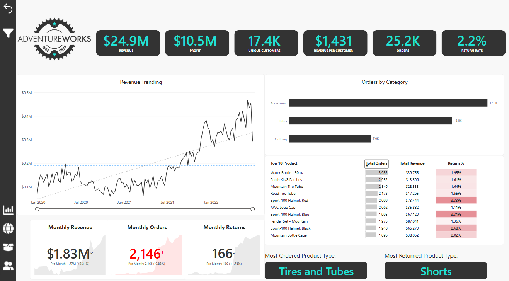
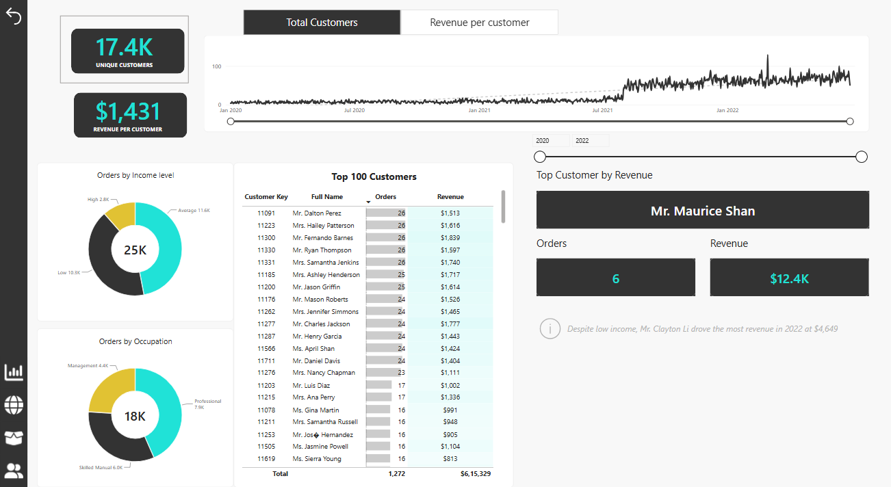
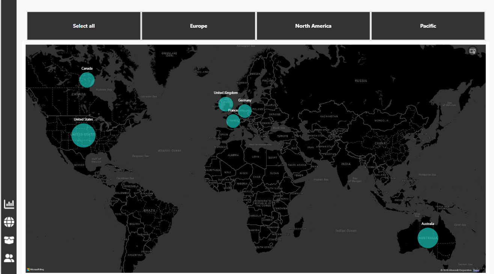

# AdventureWorks Sales Dashboard
An interactive Power BI dashboard built to analyze AdventureWorks sales performance, customer behavior, product results, returns, and geographic distribution.
## Dashboard Pages
### Executive Dashboard
- Revenue: $24.9M
- Profit: $10.5M
- Unique Customers: 17.4K
- Revenue per Customer: $1,431
- Orders: 25.2K
- Return Rate: 2.2%
- Revenue trends, category performance, and top products
### Maps
- Geographic distribution of customers and sales
- Regional analysis for Europe, North America, and Pacific markets
### Product Detail
- Product performance against monthly targets
- Revenue, profit, and order trends
- Return trend analysis
- Adjustable product price analysis
### Customer Detail
- Customer revenue and order trends
- Top 100 customers by revenue
- Customer segmentation by income level and occupation
- Customer-level order and revenue analysis
## Tools Used
- Power BI Desktop
- Power Query
- DAX
- AdventureWorks dataset
## Project Files
- `AdventureWorks_Sales_Dashboard.pbix` — Power BI report file
- `images/` — Dashboard screenshots
- `data/` — Source-data documentation or permitted sample data
- `docs/` — Additional project documentation
## Dashboard Preview
### Executive Dashboard

### Customer Detail

### Product Detail

### Maps

## Key Insights
- The business generated $24.9M in revenue and $10.5M in profit from 25.2K orders.
- The dashboard includes 17.4K unique customers, with an average revenue of $1,431 per customer.
- Revenue shows an overall upward trend, with stronger sales growth from late 2021 through 2022.
- Accessories are the highest-order category with approximately 17K orders, followed by Bikes with 13.9K orders.
- Clothing has the lowest category order volume at approximately 7K orders.
- Tires and Tubes is the most ordered product type.
- Shorts is the most returned product type.
- The overall return rate is 2.2%, highlighting an opportunity to investigate frequently returned products.
- Sales activity is concentrated in North America and Europe, with additional customer presence in the Pacific region.
- Customer analysis shows that the highest-revenue customers can be identified by order count, income level, occupation, and time period.
## Author
Manoj
